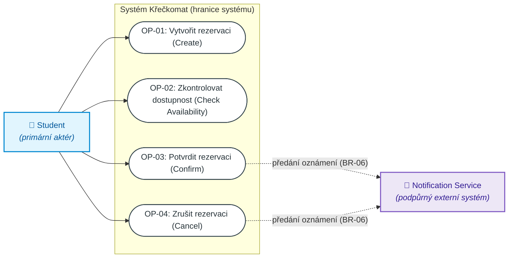
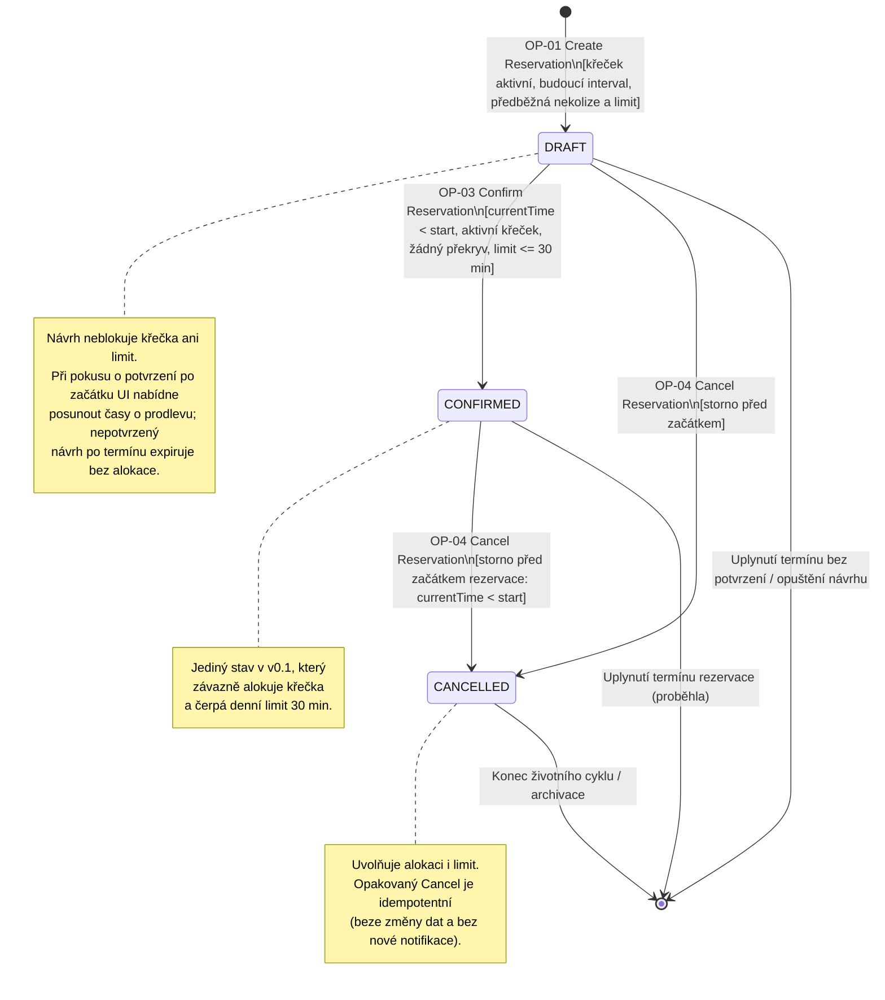
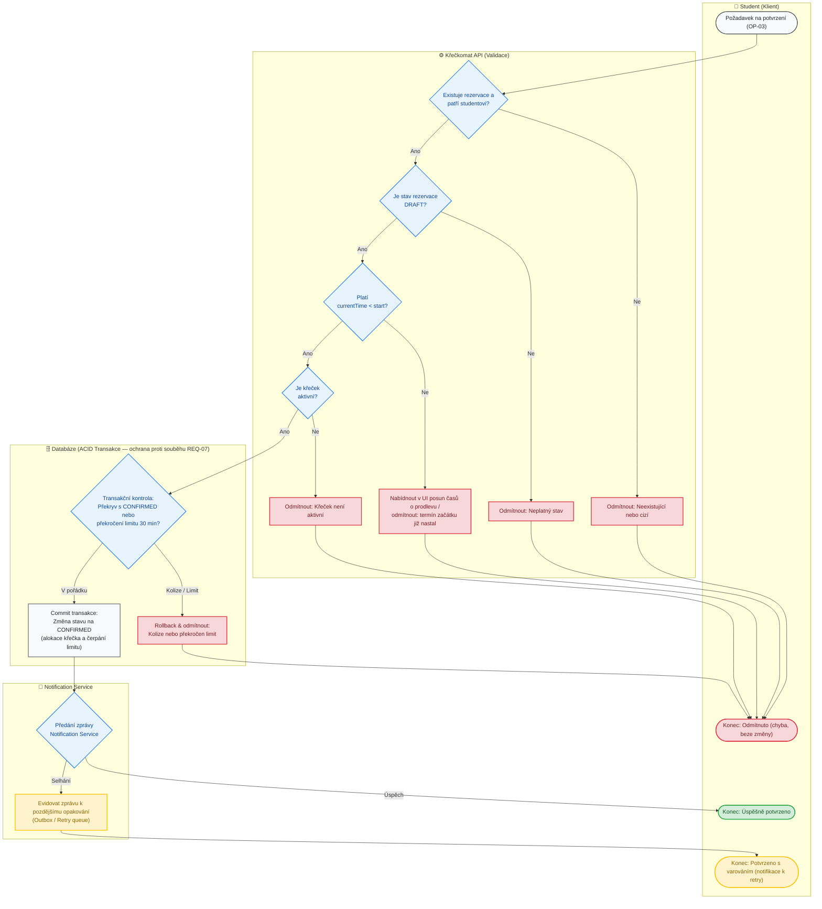
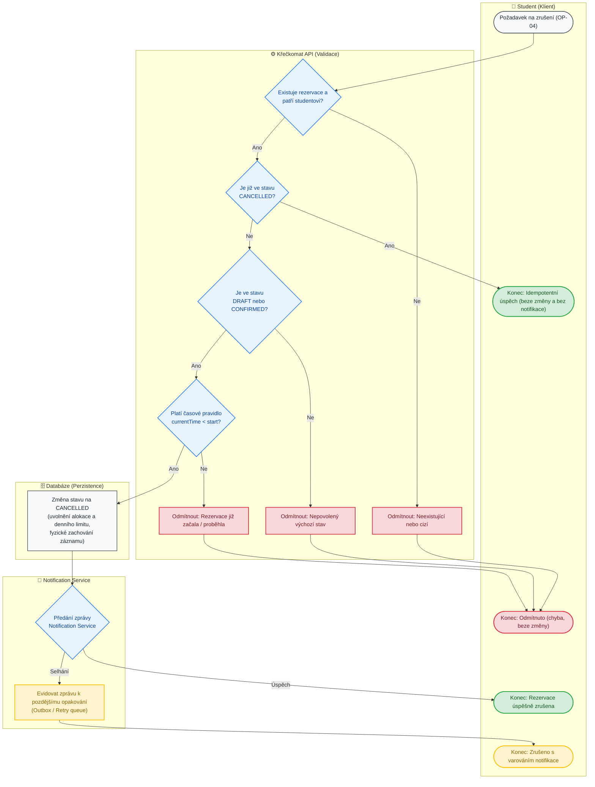
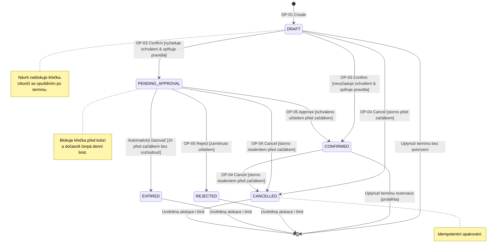
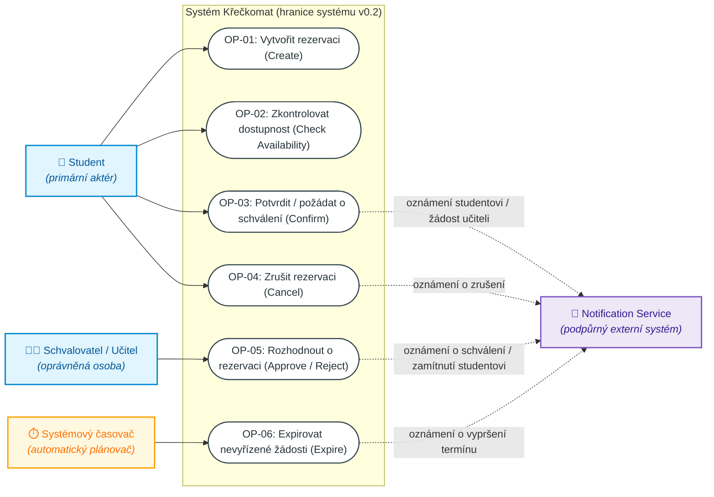

# Diagramy systému Křečkomat (C02)

Tento dokument obsahuje vizuální specifikaci chování systému **Křečkomat** pro fázi **C02**. Diagramy jsou zapsány ve formátu [Mermaid](https://mermaid.js.org/) a lze je přímo prohlížet v Markdown náhledu (např. v GitHubu nebo VS Code) i v [Mermaid Live Editoru](https://mermaid.live).

Diagramy vycházejí z doménových pravidel a požadavků definovaných v [docs/reservation-specification.md](docs/reservation-specification.md) a zohledňují rozšíření schvalovacího procesu podle [zadani.txt](zadani.txt) (Část B).

---

## Obsah

- [Část 1: Baseline v0.1 — Minimální systém](#část-1-baseline-v01--minimální-systém)
  - [1.1 Diagram případů užití (Use Case diagram — bod 9a)](#11-diagram-případů-užití-use-case-diagram--bod-9a)
  - [1.2 Stavový diagram životního cyklu Reservation (bod 9b)](#12-stavový-diagram-životního-cyklu-reservation-bod-9b)
  - [1.3 Diagram aktivit — OP-03: Potvrzení rezervace (bod 9c)](#13-diagram-aktivit--op-03-potvrzení-rezervace-bod-9c)
  - [1.4 Diagram aktivit — OP-04: Zrušení rezervace (bod 9c)](#14-diagram-aktivit--op-04-zrušení-rezervace-bod-9c)
- [Část 2: Baseline v0.2 — Změna: Schvalovací proces](#část-2-baseline-v02--změna-schvalovací-proces)
  - [2.1 Aktualizovaný stavový diagram životního cyklu (v0.2)](#21-aktualizovaný-stavový-diagram-životního-cyklu-v02)
  - [2.2 Aktualizovaný diagram případů užití (v0.2)](#22-aktualizovaný-diagram-případů-užití-v02)

---

# Část 1: Baseline v0.1 — Minimální systém

## 1.1 Diagram případů užití (Use Case diagram — bod 9a)

Diagram znázorňuje hranici systému Křečkomat, primárního aktéra (**Student**), podpůrný externí systém (**Notification Service**) a 4 základní operace minimálního systému.

- **Vazba na pravidla:** 
  - `OP-01` až `OP-04` odpovídají 4 základním operacím.
  - Asynchronní předání notifikací z operací Confirm a Cancel odpovídá pravidlu `BR-06`.

---

## 1.2 Stavový diagram životního cyklu Reservation (bod 9b)

Zachycuje celý životní cyklus rezervace v Baseline v0.1, přípustné stavy (`DRAFT`, `CONFIRMED`, `CANCELLED`), podmínky přechodů a korektní ukončení životnosti.

- **Vazba na pravidla:**
  - `BR-01`: Sémantika intervalů a časů.
  - `BR-02`: Invariant neexistence překryvu rezervací `CONFIRMED` stejného křečka.
  - `BR-03`: Politika rušení (`currentTime < start`, idempotentní úspěch pro `CANCELLED`).
  - `BR-04`: Denní limit 30 minut student–křeček.
  - `BR-05`: Význam stavů (pouze `CONFIRMED` alokuje křečka a čerpá denní limit).
- **Chování DRAFTu při expiraci času:**
  - Pokud student potvrdí návrh včas (`currentTime < start`), přejde do `CONFIRMED`.
  - Pokud uplyne termín začátku (`currentTime >= start`) a student se pokusí potvrdit, klientské rozhraní nabídne posun času o prodlevu. Pokud návrh není potvrzen, končí bez alokace prostředků.

---

## 1.3 Diagram aktivit — OP-03: Potvrzení rezervace (bod 9c)

Modeluje procesní tok a rozhodovací logiku operace **Potvrzení rezervace** pomocí **plaveckých drah (Swimlanes)**. Znázorňuje rozdělení odpovědnosti mezi klienta, validační vrstvu, atomickou databázovou transakci (ochrana proti souběhu `REQ-07`) a externí notifikační službu.

- **Barevné rozlišení:**
  - 🟢 **Zelená:** Úspěšné dokončení operace.
  - 🔴 **Červená:** Odmítnutí požadavku (beze změny stavu).
  - 🟡 **Žlutá:** Úspěšné potvrzení s varováním (selhání notifikace, zařazeno do retry).

---

## 1.4 Diagram aktivit — OP-04: Zrušení rezervace (bod 9c)

Znázorňuje průběh operace **Zrušení rezervace** rozdělený do plaveckých drah. Demonstruje okamžitý idempotentní úspěch při opakovaném volání na již zrušenou rezervaci (`REQ-09`), časové pravidlo stornování a spolehlivé uvolnění křečka.

---

# Část 2: Baseline v0.2 — Změna: Schvalovací proces

Tato část rozšiřuje systém podle **Části B zadání C02**:
> *„Některé Resources vyžadují schválení oprávněnou osobou dříve, než se Reservation může stát CONFIRMED. Schválení může být opožděno, zamítnuto nebo může vypršet.“*

### Rozhodnutí o chování v0.2:
1. **Dva režimy potvrzení křečků:**
   - **Běžný křeček (nevyžaduje schválení):** Přímé automatické potvrzení `DRAFT → CONFIRMED` (stejná pravidla kolize a limitu jako ve v0.1).
   - **Křeček vyžadující schválení (speciální resource):** Přechod `DRAFT → PENDING_APPROVAL`.
2. **Blokování prostředku v `PENDING_APPROVAL`:**
   - Aby jiný student nemohl termín mezitím zabrat, rezervace ve stavu `PENDING_APPROVAL` **křečka dočasně blokuje a započítává se do denního limitu**.
3. **Pravidla expirace a rušení:**
   - **Expirace schválení:** Pokud učitel nerozhodne nejpozději **1 hodinu před začátkem rezervace** (nebo do okamžiku začátku), systém rezervaci automaticky převede do `EXPIRED` a křeček i limit se uvolní.
   - **Storno studentem:** Student může čekající žádost zrušit (`CANCELLED`) nejpozději 15 minut před začátkem rezervace, čímž se mu limit uvolní.

---

## 2.1 Aktualizovaný stavový diagram životního cyklu (v0.2)

Zachycuje všechny stavy včetně schvalovacího procesu (`PENDING_APPROVAL`), zamítnutí (`REJECTED`) a expirace (`EXPIRED`) a obsahuje řádné zakončení životního cyklu (`[*]`).

---

## 2.2 Aktualizovaný diagram případů užití (v0.2)

Do systému přibývá nová role aktéra (**Schvalovatel / Učitel**), systémový aktér (**Automatický časovač / Scheduler**) a nová operace **OP-05: Rozhodnout o rezervaci (Approve / Reject)**. Notifikační služba informuje učitele o nové žádosti a studenta o výsledku schválení/zamítnutí.

