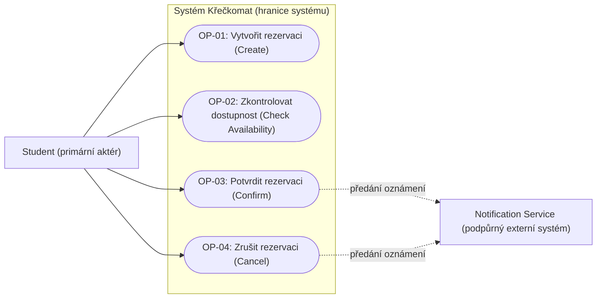
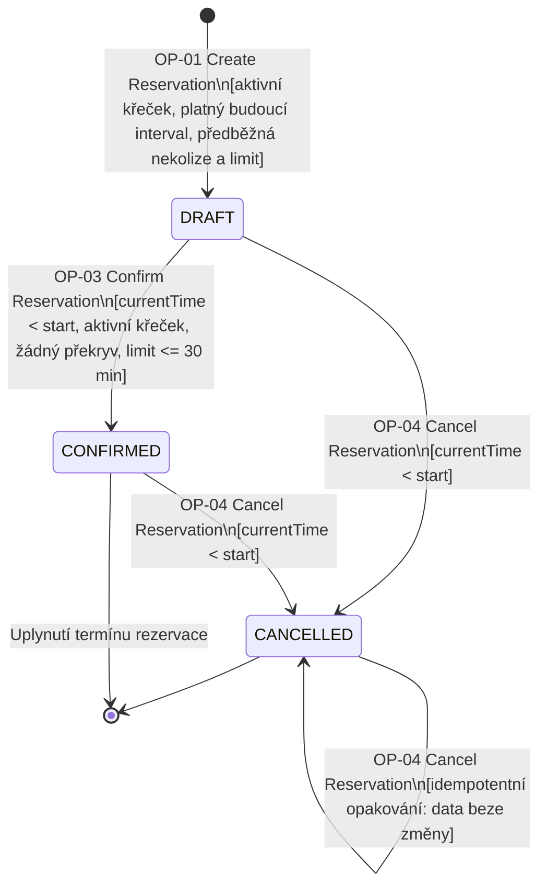
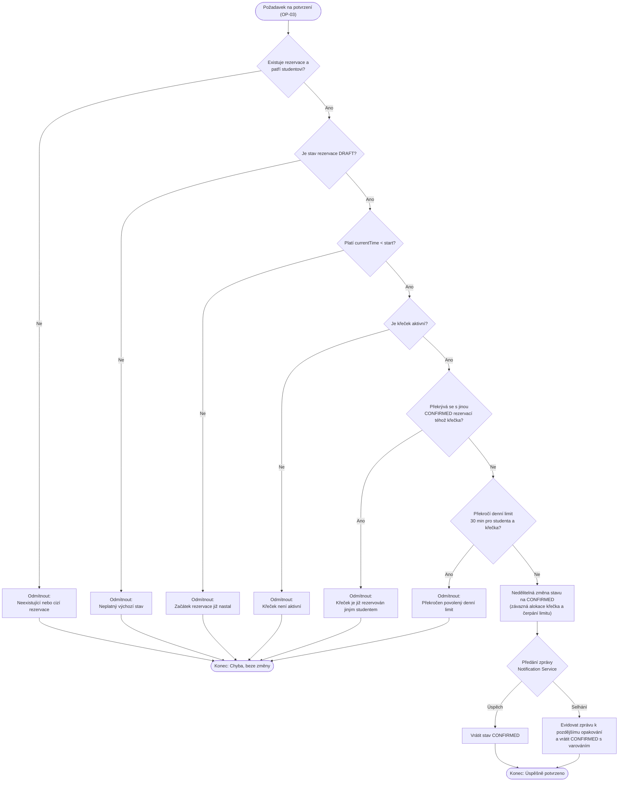
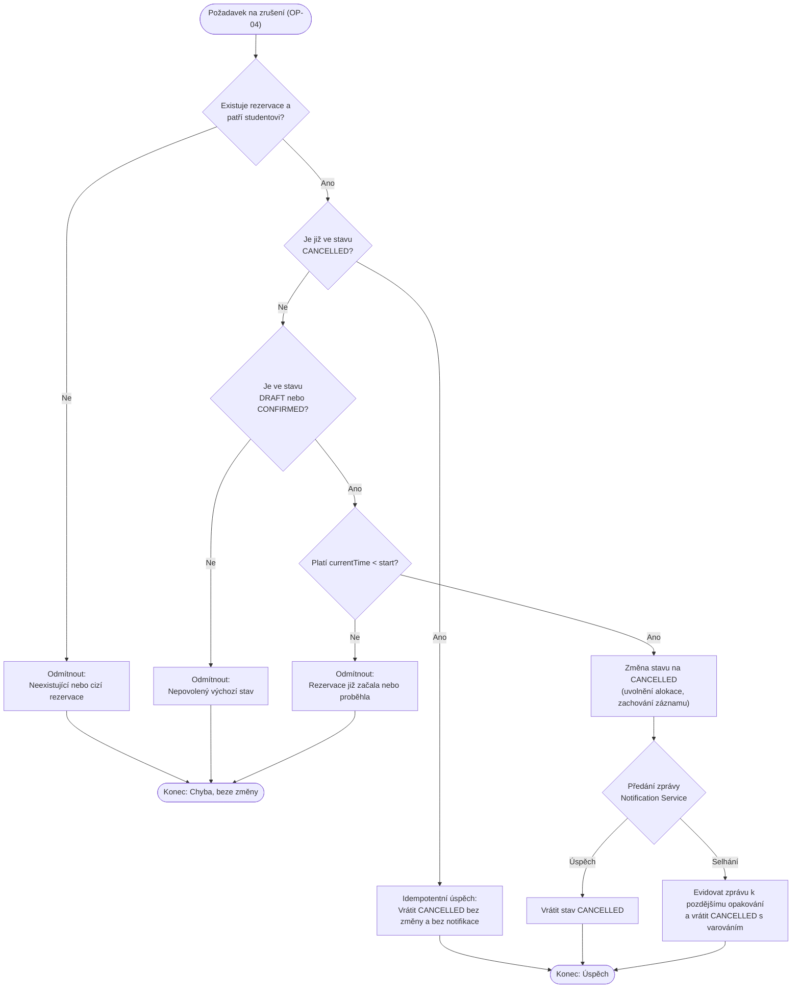
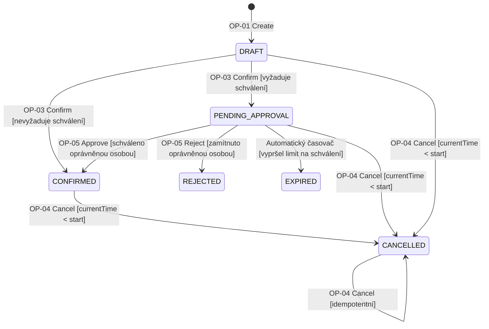
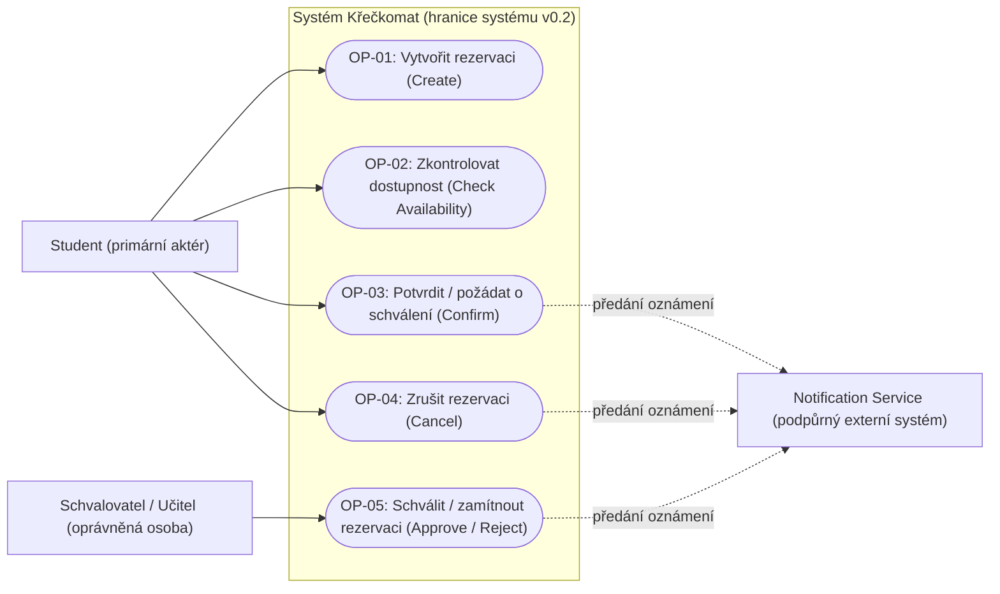

# Diagramy systému Křečkomat (C02)

Tento dokument obsahuje vizuální specifikaci chování systému **Křečkomat** pro fázi **C02**. Diagramy jsou zapsány ve formátu [Mermaid](https://mermaid.js.org/) a lze je přímo prohlížet v Markdown náhledu (např. v GitHubu nebo VS Code) i v [Mermaid Live Editoru](https://mermaid.live).

Diagramy vycházejí z doménových pravidel a požadavků definovaných v [docs/reservation-specification.md](docs/reservation-specification.md).

---

## Obsah

- [Část 1: Baseline v0.1 — Minimální systém](#část-1-baseline-v01--minimální-systém)
  - [1.1 Diagram případů užití (Use Case diagram — bod 9a)](#11-diagram-případů-užití-use-case-diagram--bod-9a)
  - [1.2 Stavový diagram životního cyklu Reservation (bod 9b)](#12-stavový-diagram-životního-cyklu-reservation-bod-9b)
  - [1.3 Diagram aktivit — OP-03: Potvrzení rezervace (bod 9c)](#13-diagram-aktivit--op-03-potvrzení-rezervace-bod-9c)
  - [1.4 Diagram aktivit — OP-04: Zrušení rezervace (bod 9c)](#14-diagram-aktivit--op-04-zrušení-rezervace-bod-9c)
- [Část 2: Baseline v0.2 — Změna: Schvalovací proces](#část-2-baseline-v02--změna-schvalovací-proces)
  - [2.1 Aktualizovaný stavový diagram životního cyklu (v0.2)](#21-aktualizovaný-stavový-diagram-životního-cyklu-v02)
  - [2.2 Aktualizovaný diagram případů užití (v0.2)](#22-aktualizovaný-diagram-případů-užití-v02)

---

# Část 1: Baseline v0.1 — Minimální systém

## 1.1 Diagram případů užití (Use Case diagram — bod 9a)

Diagram znázorňuje hranici systému Křečkomat, primárního aktéra (**Student**), podpůrný externí systém (**Notification Service**) a všechny 4 základní operace minimálního systému.

- **Vazba na pravidla:** 
  - `OP-01` až `OP-04` odpovídají 4 základním operacím.
  - Asynchronní předání notifikací z operací Confirm a Cancel odpovídá pravidlu `BR-06`.

---

## 1.2 Stavový diagram životního cyklu Reservation (bod 9b)

Zachycuje celý životní cyklus rezervace v Baseline v0.1, přípustné stavy (`DRAFT`, `CONFIRMED`, `CANCELLED`), podmínky přechodů a idempotentní opakování rušení.

- **Vazba na pravidla:**
  - `BR-01`: Sémantika intervalů a časů.
  - `BR-02`: Invariant neexistence překryvu rezervací `CONFIRMED` stejného křečka.
  - `BR-03`: Politika rušení (`currentTime < start`, idempotentní úspěch pro `CANCELLED`).
  - `BR-04`: Denní limit 30 minut student–křeček.
  - `BR-05`: Význam stavů (pouze `CONFIRMED` alokuje křečka a čerpá denní limit).

---

## 1.3 Diagram aktivit — OP-03: Potvrzení rezervace (bod 9c)

Modeluje procesní tok a rozhodovací logiku klíčové stavotvorné operace **Potvrzení rezervace**. Znázorňuje vyhodnocení všech předpokladů a invariantů před závaznou alokací i odolné chování při selhání notifikační služby.

- **Vazba na pravidla:**
  - `REQ-05`: Podmínky potvrzení (aktivita, čas, nepřekročení limitu a zákaz kolize).
  - `REQ-06`: Nedělitelná změna a zachování stavu `CONFIRMED` i při selhání `Notification Service` (vrácení varování + zařazení k retry).
  - `REQ-07`: Ochrana invariantů při souběžném potvrzování.

---

## 1.4 Diagram aktivit — OP-04: Zrušení rezervace (bod 9c)

Znázorňuje průběh operace **Zrušení rezervace**, včetně kontroly vlastnictví, časové hranice (`currentTime < start`), idempotentní cesty a uvolnění alokovaného křečka.

- **Vazba na pravidla:**
  - `REQ-08`: Zrušení před začátkem, fyzické nesmazání záznamu a evidence nedoručeného oznámení při selhání.
  - `REQ-09`: Odmítnutí při `currentTime >= start` a idempotentní výsledek pro již zrušené rezervace.

---

# Část 2: Baseline v0.2 — Změna: Schvalovací proces

Tato část rozšiřuje systém podle **Části B zadání C02**:
> *„Některé Resources vyžadují schválení oprávněnou osobou dříve, než se Reservation může stát CONFIRMED. Schválení může být opožděno, zamítnuto nebo může vypršet.“*

---

## 2.1 Aktualizovaný stavový diagram životního cyklu (v0.2)

Přidává stav `PENDING_APPROVAL`, stav po zamítnutí (`REJECTED`) a stav po vypršení časového limitu na schválení (`EXPIRED`).

- Křečci nevyžadující schválení přecházejí přímo `DRAFT → CONFIRMED`.
- Křečci vyžadující schválení přecházejí nejprve do `PENDING_APPROVAL`.
- Rezervaci ve stavu `PENDING_APPROVAL` může student zrušit (`CANCELLED`) před začátkem rezervace.

---

## 2.2 Aktualizovaný diagram případů užití (v0.2)

Do systému přibývá nová role aktéra (**Schvalovatel** — např. učitel nebo správce křečků) a nová operace **OP-05: Schválit / zamítnout rezervaci**.

